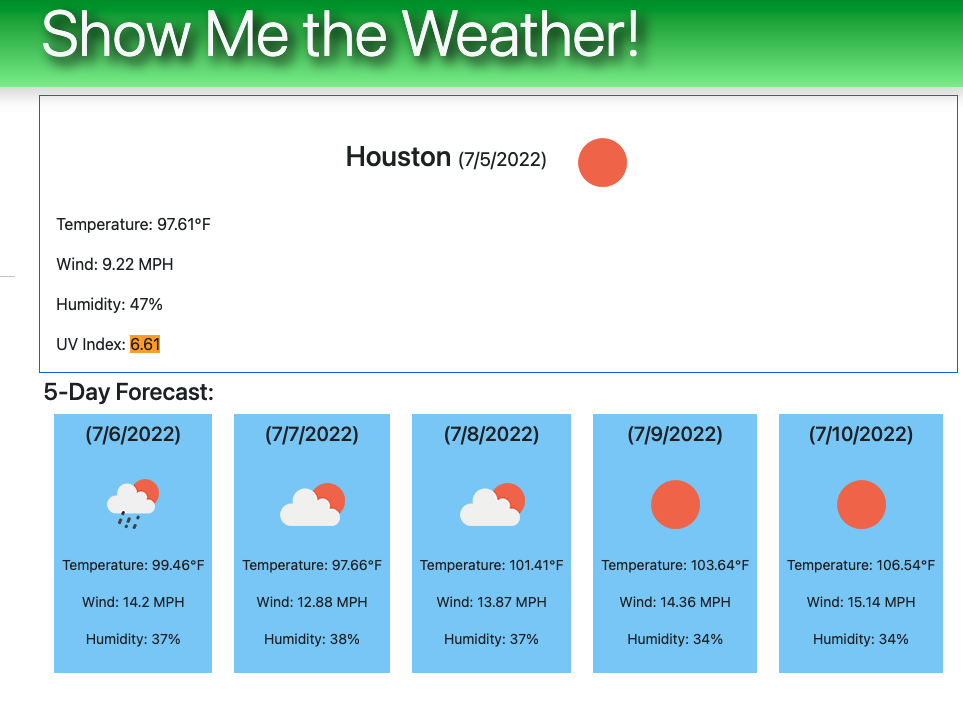

# Show-Me-The-Weather

## Description
Application to display current weather and five day forecast

On the project learning: 
* Server Side API use
* Continual testing for accurate deployment
* Developing CSS skills, building with Bootstrap
* Local Storage usage  

Challenges:
* Navigating API documentation for correct base url
* Clearing HTML data; reading documentation on innerHTML solved this quickly 

## Built With
* Javascript, HTML, CSS, Bootstrap
 

## Website
Visit the [project](https://violanerd.github.io/Show-Me-The-Weather/)

## Contribution

Coded by Madalyne Cross